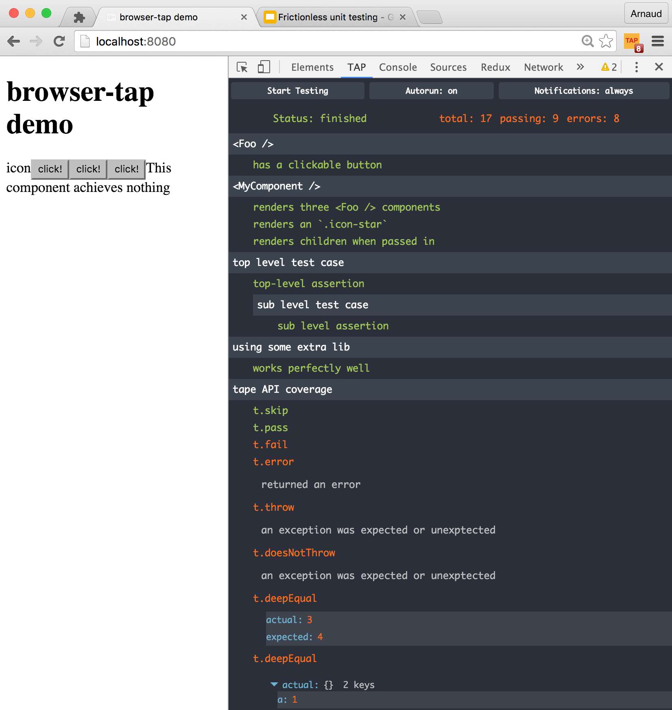

# browser-tap extension

[Install from Chrome Web Store](https://chrome.google.com/webstore/detail/browser-tap/ncfblaiipckncgeipgmpdioedcdmofei)

## Concept

The way `browser-tap` is inspired by [`zalmoxisus/redux-devtools-extension`](https://github.com/zalmoxisus/redux-devtools-extension).

This extension injects `window.tapExtension` as function in the inspected window. This function is picked up and called by the `browser-tap` wrapper. It will delegate the execution of tests and forward the results to the devtools panel.



## Manual installation

To build the extension, go into the `extension` folder, simply run:

```sh
npm install
npm run build # or npm start for a watch mode
```

Then, simple follow the [official guide](https://developer.chrome.com/extensions/getstarted#unpacked) to load the build extension from `./extension/dist`

Reloading the extension after a build is quite painful:

1. click the `Reload` button in [`chrome://extensions`](chrome://extensions)
1. close + reopen the DevTools
